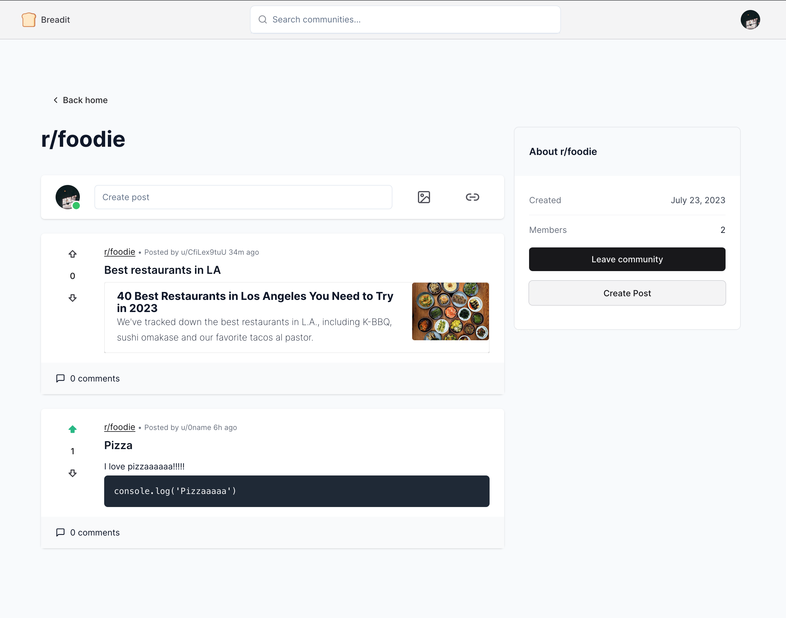
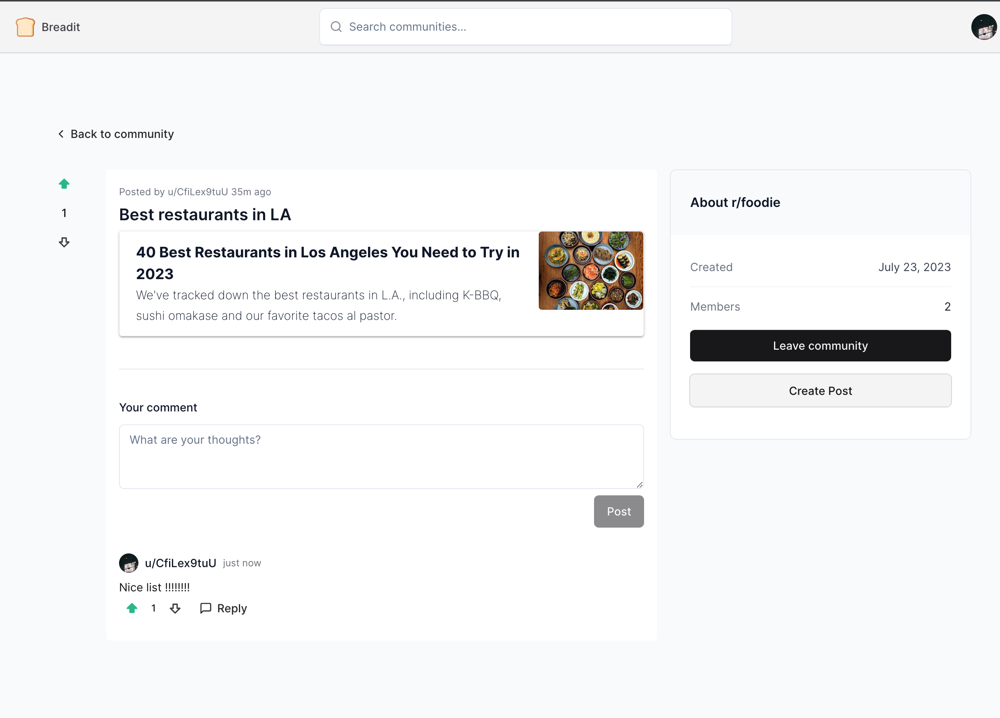

# Breadit
Breadit is a Fullstack Reddit clone built with Next.js 13 and TypeScript

Lets check it out in action (recommend open in Chrome) :point_right: [Breadit](https://ho-breadit.vercel.app/)

### Features
- General feeds
- Custom feeds for authenticated users
- Infinite scrolling for dynamically loading posts
- Highly functional post editor
- Image uploads & link previews
- Comments and Nested Replies
- Search bar
- Change username
- Responsive UI built with TailwindCSS
- Advanced caching using Upstash Redis
- Modern data fetching using React-Query
- Google authentication

### Technologies
- Built with Next.js 13 & TypeScript
- Next-Auth (Google Auth), JWT
- React-Query
- Upstadh Redis
- TailwindCSS
- Icons from Lucide
- UI components from [shadcn/ui](https://ui.shadcn.com)

### Preview
| **HomePage** |
|:---:|
|  
|**Community Page** |
|  | 
| **Post Page with Comments** |
|  |
